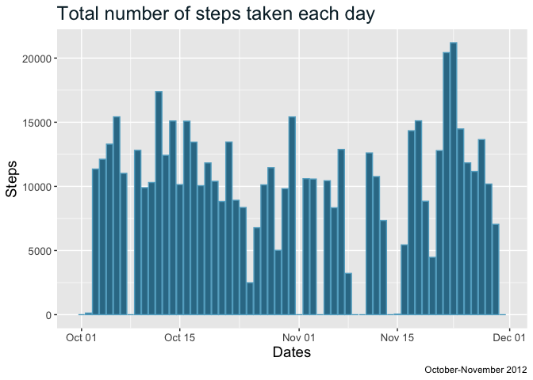
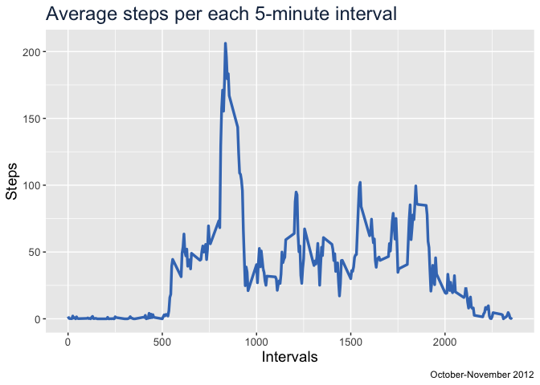
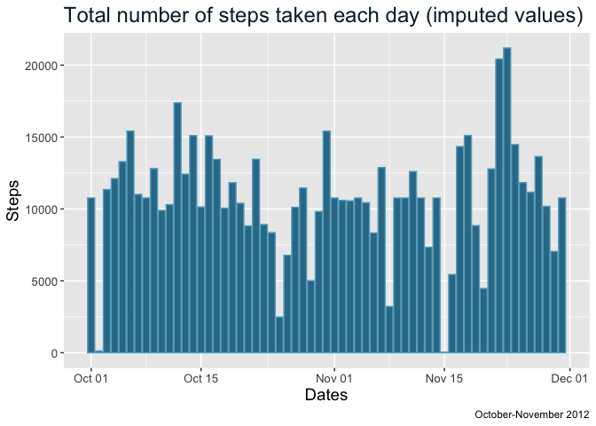
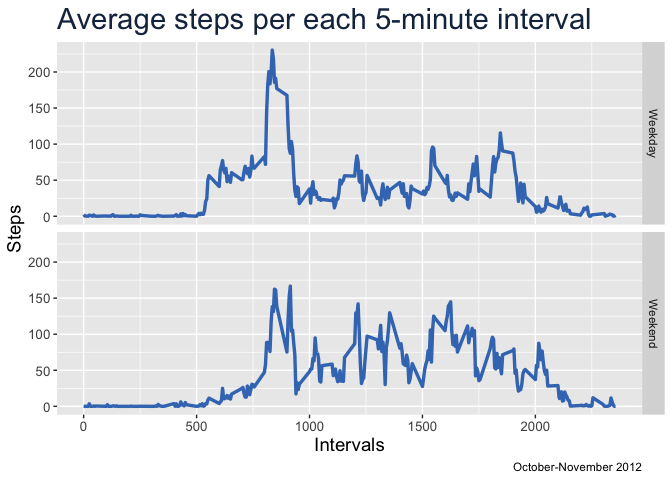

## Introduction

This assignment makes use of data from a personal activity monitoring device. This device collects data at 5 minute intervals through out the day. The data consists of two months of data from an anonymous individual collected during the months of October and November, 2012 and include the number of steps taken in 5 minute intervals each day.
  
## Loading and preprocessing the data

First, we are going to load a couple of required libraries:


```r
library(dplyr)
```

```
## 
## Attaching package: 'dplyr'
```

```
## The following objects are masked from 'package:stats':
## 
##     filter, lag
```

```
## The following objects are masked from 'package:base':
## 
##     intersect, setdiff, setequal, union
```

```r
library(ggplot2)
```

Now we will unzip the file, load it to a variable and take a look at its structure:


```r
unzip("activity.zip")
activ <- read.csv("activity.csv")
str(activ)
```

```
## 'data.frame':	17568 obs. of  3 variables:
##  $ steps   : int  NA NA NA NA NA NA NA NA NA NA ...
##  $ date    : chr  "2012-10-01" "2012-10-01" "2012-10-01" "2012-10-01" ...
##  $ interval: int  0 5 10 15 20 25 30 35 40 45 ...
```
  
## Mean total number of steps taken per day

##### 1. Let's make a histogram of the total number of steps taken each day

We are going to generate a file to be plotted (pasosDia)  
**Missing values are ignored**


```r
pasosDia <- tapply(activ$steps, activ$date, sum, na.rm = TRUE) |>
                cbind(unique(activ$date)) |>
                as.data.frame()
colnames(pasosDia) <- c("Steps", "Dates")
pasosDia <- mutate(pasosDia, Steps = as.numeric(Steps), Dates = as.Date(Dates))
```

Now we plot the previously generated file:


```r
ggplot(pasosDia) +
    aes(Dates, Steps) +
    geom_bar(stat = "identity", colour = '#63ADCA', fill = '#337995') +
    labs(title = "Total number of steps taken each day",
         caption = "October-November 2012") +
    theme(plot.title = element_text(size = 18, colour = '#092733'),
          axis.text=element_text(size=10),
          axis.title=element_text(size=14))
```

<!-- -->

##### 2. Want to know what the **mean** and **median** total number of steps taken per day


```r
cat("The mean of steps taken per day is:",
    mean(tapply(activ$steps, activ$date, sum), na.rm = TRUE),
    "\n\n And the median of steps taken per day is:",
    median(tapply(activ$steps, activ$date, sum), na.rm = TRUE))
```

```
## The mean of steps taken per day is: 10766.19 
## 
##  And the median of steps taken per day is: 10765
```
  
## Average daily activity pattern

##### 1. Time series plot of the 5-minute interval (x-axis) and the average number of steps taken, averaged across all days (y-axis)

First, generate the file to be plotted:


```r
intvs <- tapply(activ$steps, activ$interval, mean, na.rm = TRUE) |>
                cbind(unique(activ$interval)) |>
                as.data.frame()
colnames(intvs) <- c("Steps", "Intervals")
```

Now we plot:


```r
ggplot(intvs) +
    aes(Intervals, Steps) +
    geom_line(linewidth = 1.2, colour = '#4079bf') +
    labs(title = "Average steps per each 5-minute interval",
         caption = "October-November 2012") +
    theme(plot.title = element_text(size = 18, colour = '#19304d'),
          axis.text=element_text(size=10),
          axis.title=element_text(size=14))
```

<!-- -->

##### 2. Which 5-minute interval, on average across all the days in the dataset, contains the maximum number of steps?


```r
cat("The maximum average number of recorded steps is:",
    max(intvs$Steps, na.rm = TRUE),
    "\n\n And the interval containing that maximum value is:",
    intvs$Intervals[intvs$Steps == max(intvs$Steps, na.rm = TRUE)]
)
```

```
## The maximum average number of recorded steps is: 206.1698 
## 
##  And the interval containing that maximum value is: 835
```
  
## Imputing missing values

There are a number of days/intervals where there are missing values (coded as NA)

##### 1. Total number of missing values in the dataset


```r
NAs <- is.na(activ$steps)
qNAs <- length(activ$steps[NAs])

cat("The total number of missing values in the dataset is:",
    qNAs, paste0("(",scales::percent(qNAs/nrow(activ)),")")
)
```

```
## The total number of missing values in the dataset is: 2304 (13%)
```

##### 2. Create a new dataset with missing values replaced by the mean of the corresponding 5-minute intervals


```r
activ2 <- activ

for (i in c(1:nrow(activ2))) {
    if(is.na(activ2$steps[i])) {
        activ2$steps[i] <- intvs$Steps[intvs$Intervals==activ2$interval[i]]
    }
}

rm(i)

pasos2 <- tapply(activ2$steps, activ2$date, sum) |>
                cbind(unique(activ2$date)) |>
                as.data.frame()

colnames(pasos2) <- c("Steps", "Dates")

pasos2 <- mutate(pasos2, Steps = as.numeric(Steps), Dates = as.Date(Dates))
```

##### 3. Histogram of the total number of steps taken each day, including the imputed values


```r
ggplot(pasos2) +
    aes(Dates, Steps) +
    geom_bar(stat = "identity", colour = '#63ADCA', fill = '#337995') +
    labs(title = "Total number of steps taken each day (imputed values)",
         caption = "October-November 2012") +
    theme(plot.title = element_text(size = 18, colour = '#092733'),
          axis.text=element_text(size=10),
          axis.title=element_text(size=14))
```

<!-- -->

##### 4. Mean and median total number of steps taken per day, including the imputed values


```r
cat("The mean of steps taken per day (imputed values) is:",
    mean(pasos2$Steps),
    "\n\n And the median of steps taken per day (imputed values) is:",
    median(pasos2$Steps)
)
```

```
## The mean of steps taken per day (imputed values) is: 10766.19 
## 
##  And the median of steps taken per day (imputed values) is: 10766.19
```

Means calculated with missing values and with imputed values are coincident. This result is consequence of the chosen strategy i.e. to replace the missing values with the mean of the corresponding intervals. So, this "local" means doesn't affect the "global" mean.
  
## Differences in activity patterns between weekdays and weekends

##### 1. Create a new factor variable in the dataset with two levels -- "weekday" and "weekend" indicating whether a given date is a weekday or weekend day


```r
activ2 <- mutate(activ2, date = as.Date(date))

for (i in c(1:nrow(activ2))) {
    if(weekdays(activ2$date[i]) %in% c("Saturday", "Sunday")) {
        activ2$Days[i] <- "Weekend"
    } else(activ2$Days[i] <- "Weekday")
}

activ3 <- aggregate(activ2$steps, by=list(activ2$interval, activ2$Days), FUN = mean)

colnames(activ3) <- c("Intervals", "Days","Steps")
```

##### 2. Panel plot containing a time series plot (i.e. type = "l") of the 5-minute interval (x-axis) and the average number of steps taken, averaged across all weekday days or weekend days (y-axis)


```r
ggplot(activ3) +
    aes(Intervals, Steps) +
    geom_line(linewidth = 1.2, colour = '#4079bf') +
    labs(title = "Average steps per each 5-minute interval",
         caption = "October-November 2012") +
    theme(plot.title = element_text(size = 22, colour = '#19304d'),
          axis.text=element_text(size=10),
          axis.title=element_text(size=14)) +
    facet_grid(rows = vars(Days))
```

<!-- -->
